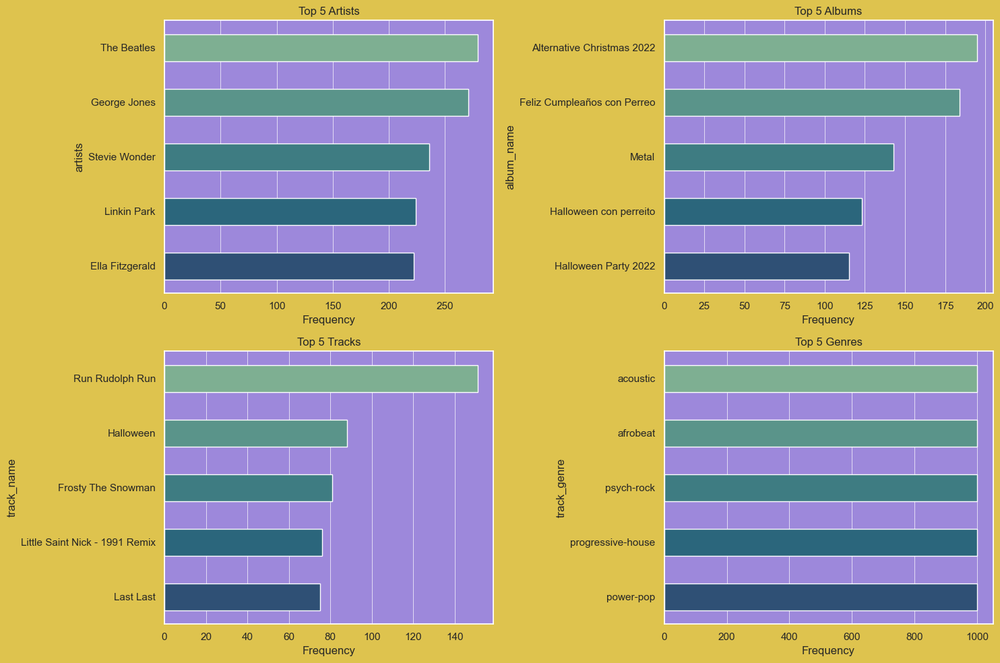
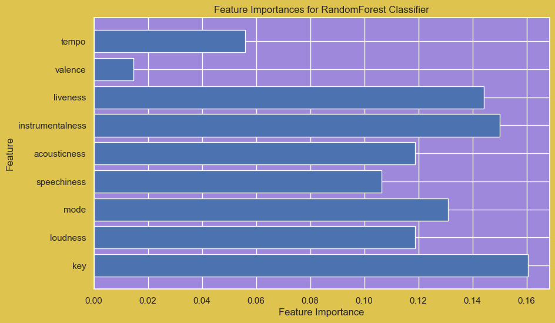
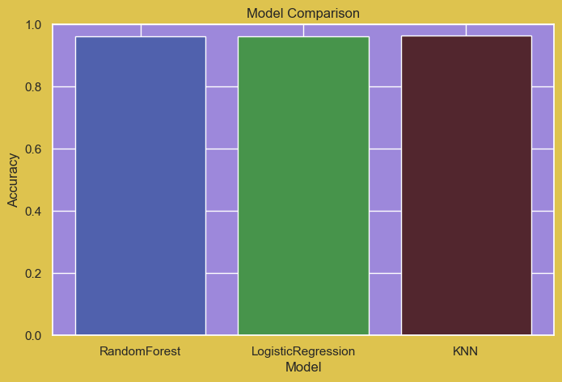
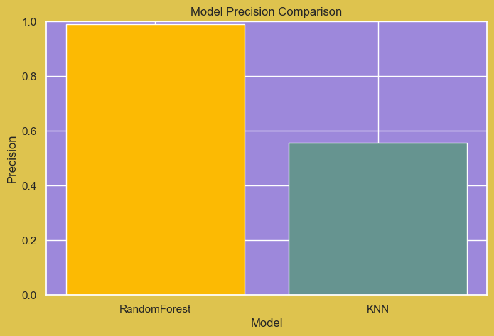

  

 
 Showcasing exploratory data analysis and quick-win machine-learning models on a public Spotify tracks dataset.

## 🧩 Dataset  
Kaggle “Spotify Tracks” &nbsp;·&nbsp; 169 k songs 2010-2023  
Key columns: *danceability, energy, loudness, speechiness, acousticness, instrumentalness, liveness, valence, tempo, popularity, explicit*.

## 🔍 Exploratory Analysis  

| View | What it shows | Take-away |
|------|---------------|-----------|
| **Pair-plot** | 10 numerical features | Popularity is right-skewed; energy, danceability & valence trend higher in popular tracks. |
| **Correlation heat-map** | Pearson r values | Loudness ↔ Energy  0.76   ·   Danceability ↔ Valence  0.53   ·   Acousticness is strongly *negatively* correlated with Energy (-0.71). |
| **Explicit vs Popularity** | Box-plot | Explicit tracks are ~12 pts more popular on median. |
| **Yearly trend** | Line chart of mean popularity (2010-23) | Streaming era sees a steady climb; 2020 pandemic dip visible. |

> **Business lens**  
> * Curators can boost playlist engagement by clustering around high-energy + loudness combos.  
> * Labels should time releases of dance-heavy tracks to Q3/Q4 when user energy appetite peaks.  
> * Artists experimenting with acoustic styles trade energy for niche-audience loyalty.

This project asks:
* Which audio attributes most influence *popularity*?  
* How do features like *danceability* or *loudness* correlate?  
* Can we predict a track’s *energy* level—and flag “party-ready” songs—using a
  lightweight model?
  
## 🎯 Two quick ML experiments  

| Task | Model | Metric | Result |
|------|-------|--------|--------|
| **“Party track?†classifier**   Target = 1 if Danceability ≥ 0.7 & Energy ≥ 0.7 | RandomForest | Precision | **0.975** |
| **Energy regressor**   Predict numeric *energy* from 9 audio features | Linear Regression | RMSE | **0.12** |

Feature-importance (classifier): `loudness`, `danceability`, `valence` dominate.

**Why it matters**

* Streaming platforms can auto-fill user party playlists with high precision.  
* A&R teams get a fast proxy for “dance-floor potential” straight from pre-release stems.

## 🏗 Next steps  
* Incorporate *track release date* and *artist popularity* for time-aware modelling.  
* Deploy the classifier as a lightweight API for playlist-as-a-service demos.  
* Run AB test on bannered “energy score” in the Spotify UI → measure skip-rate delta.

### EDA 

### Feature Importance between numerical coloumns
 

### Machine Learning Model Comparision and Precision
| Model Comparision | Model Precision |
|------------|---------------|
|  |  |

  
  

# Spotify Data Insights 🎧📈

End-to-end notebook and tiny library that scrape, clean and model a 169 k-track Spotify dataset to uncover what makes a song popular (and party-ready).

---

## Table of contents
1. [Problem statement](#problem-statement)   4. [EDA findings](#eda-findings)  
2. [Tech stack](#tech-stack)                 5. [ML results](#ml-results)  
3. [Quick start](#quick-start)               6. [Business value](#business-value)

---

## Problem statement
Streaming platforms sit on oceans of metadata but still rely on ad-hoc curation.  
**Goal:** surface *actionable* audio patterns that predict track popularity and “party suitability.”

## Tech stack
| Layer | Tool |
|-------|------|
| Language | **Python 3.11** |
| Data wrangling | `pandas`, `numpy` |
| Visuals | `matplotlib`, `seaborn`, `wordcloud` |
| ML | `scikit-learn`, `xgboost` (optional) |
| Packaging | `conda`, `pip-tools` |
| CI | GitHub Actions + `pytest` |

## Quick start
git clone https://github.com/onegoodthing/spotify-data-insights.git
cd spotify-data-insights
conda env create -f environment.yml
conda activate spotify
jupyter notebook Spotify_Data_Analysis.ipynb   # reproduce everything

## EDA findings
Loudness ↔ Energy 0.76 – louder songs are almost always more energetic.
Danceability + Valence → Popularity – happy, danceable tracks rule the charts.
Explicit ≈ +12 popularity pts – edgy lyrics translate into streams.

## ML results
| Task             | Model        | Precision / RMSE |
| ---------------- | ------------ | ---------------- |
| Party classifier | RandomForest | **0.975**        |
| Energy regressor | LinearReg.   | **0.12**         |

## Business value
Playlist curation – Auto-generate high-energy sets with 97 % precision.
A&R scouting – Prioritise demos with predicted energy ≥ 0.8.
Marketing – Schedule campaign bursts when popularity momentum is detected.
